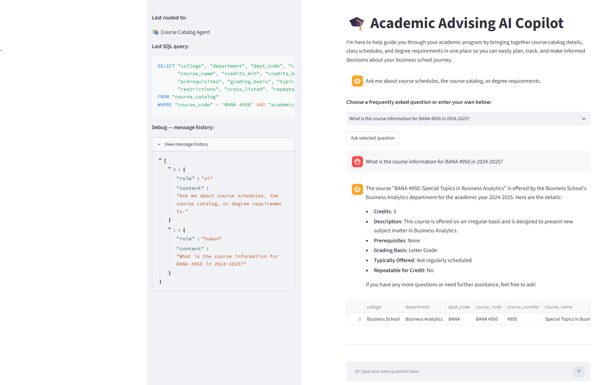
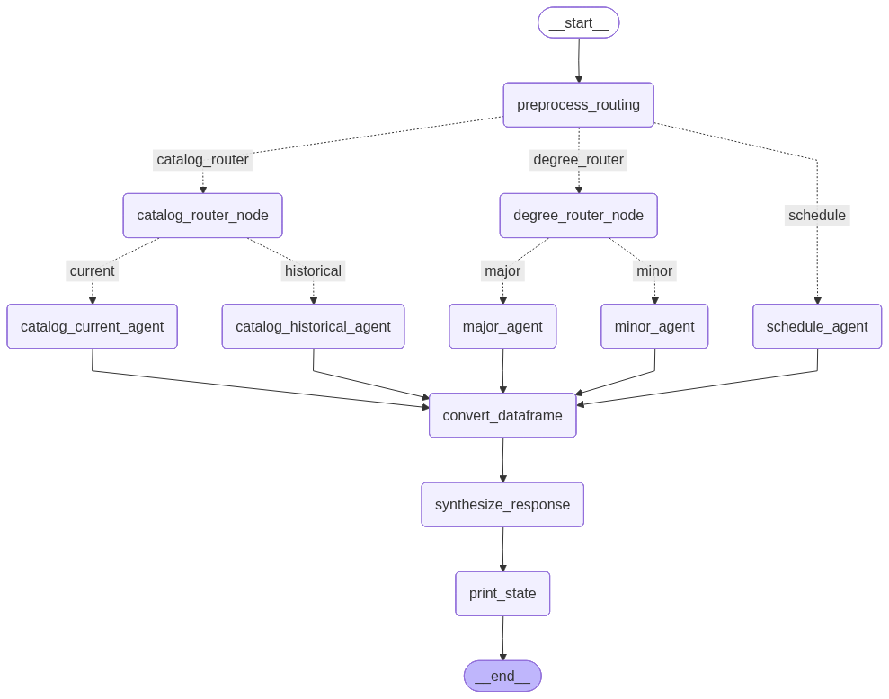

# Academic Advising AI Assistant

## Project Overview

This project explores how generative AI and a multi-agent architecture can be used to make complex academic advising information easier for students to access and understand. The project included the creation of a structured SQL database from multiple university information sources, including course catalogs, academic advising and degree-requirement resources, and academic-year class schedules. A LangGraph-based routing architecture interprets natural-language student questions and directs them to specialized agents for course catalog, class schedule, major, or minor information. The appropriate agent generates a SQL query against the academic database, retrieves the relevant information, and passes the results to a response-synthesis step that presents the answer in a clear, conversational format. The application is deployed through Streamlit and provides students with a single interface for asking questions that would otherwise require searching across multiple university resources.

The project demonstrates how unstructured and distributed organizational information can be transformed into a structured data source and paired with generative AI to create a more accessible user interface. The goal was not simply to build a chatbot, but to create a workflow in which natural-language questions are interpreted, translated into structured database queries, and converted into useful responses.

  

## Data Preparation

A significant part of the project involved creating the SQL data source used by the AI application.

Academic information was collected, cleaned, standardized, and organized from multiple university resources, including:

- University course catalog information
- Academic advising resources and program requirements
- Academic-year class schedules

Information from these separate sources was integrated into a structured SQL database so that the AI agents could query academic information consistently.

This data preparation step was necessary because the information students need for academic planning is often distributed across multiple documents and resources rather than contained in a single structured dataset.

## Multi-Agent Architecture

The application uses a LangGraph-based multi-agent workflow to route each student's question to the most appropriate academic data source and generate the SQL needed to answer it.

Rather than asking a single AI model to interpret the question, locate the appropriate data, query the database, and construct the final response, the workflow separates these responsibilities into specialized routing and processing stages.

### Application Workflow

The diagram below shows how a student's question is routed through the specialized agents before the results are synthesized into a final response.

### 1. Question Interpretation & Routing

The initial routing layer interprets the student's natural-language question and determines whether the answer requires:

- Course catalog information
- Class schedule information
- Degree requirement information

Questions are then routed further when necessary:

- **Course catalog questions** are classified as current or historical.
- **Degree requirement questions** are classified as major or minor.
- **Schedule questions** are sent directly to the schedule agent.

### 2. Specialized SQL Agents

Five specialized SQL agents generate queries for their respective areas:

- **Current Catalog Agent** — current course descriptions, prerequisites, credits, restrictions, and other catalog information
- **Historical Catalog Agent** — course information from previous academic years
- **Schedule Agent** — semester-specific class schedules, instructors, times, locations, and delivery formats
- **Major Requirements Agent** — major requirements, required courses, electives, and program structure
- **Minor Requirements Agent** — minor requirements, prerequisites, electives, credit requirements, and program policies

Each agent receives the interpreted question and generates SQL appropriate to its portion of the academic database.

### 3. Database Query & Response Generation

The generated SQL is executed against the application's SQLite database. Query results are converted into a common data structure and passed to a response-synthesis step.

The response synthesizer converts the database results into a clear, concise answer appropriate to the student's question. Depending on the result, information can be presented conversationally or organized into tables and lists.

This separation of routing, SQL generation, data retrieval, and response generation allows the application to use specialized instructions for different types of academic information.

## Tools & Skills

- Python
- SQL
- Generative AI / Large Language Models
- Multi-Agent AI Architecture
- Prompt Engineering
- Data Cleaning and Integration
- Relational Data Design
- Streamlit
- Natural-Language Interfaces

## Application

A deployed version of the Academic Advising AI Assistant is available through Streamlit:

[Launch the Academic Advising AI Assistant](https://academic-advising-ai-copilot-mvvkzubuqmehmwqoskzlu4.streamlit.app/)

> **Please note:** The application is hosted using Streamlit's shared hosting environment. If the application has been inactive, it may need to restart before opening. The initial load can take up to approximately five minutes.

## Project Repository

The repository contains the Python application, agent components, supporting data, environment configuration, and application dependencies.
